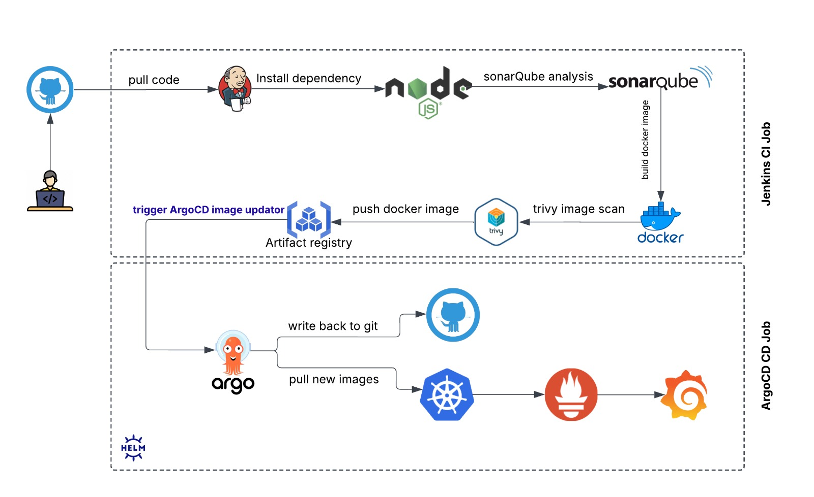

# 🛠️ CI/CD Pipeline Project on AWS with Terraform, Jenkins, and ArgoCD

## 🚀 Overview

This project demonstrates a complete CI/CD pipeline setup on AWS using **Terraform**, **Jenkins**, **SonarQube**, **Trivy**, **DockerHub**, and **ArgoCD**. The infrastructure is provisioned using Infrastructure as Code (IaC) with **Terraform**, while continuous integration and deployment are handled by Jenkins and ArgoCD respectively. The pipeline includes static code analysis, container image scanning, Docker image creation, and deployment to an EKS cluster using GitOps.
---

## 🧱 Architecture Diagram


### Jenkins CI Pipeline:
- Pulls code from GitHub.
- Analyzes code quality with SonarQube.
- Builds Docker image.
- Scans image vulnerabilities using Trivy.
- Pushes secure image to DockerHub.

### ArgoCD GitOps (CD):
- Deployed in the EKS cluster using Helm.
- Syncs with the GitHub repo to deploy the application automatically to Kubernetes.

# 🚀 Steps I Followed

## 🔧 Jenkins Setup (on EC2 in Public Subnet)
The Jenkins master node is hosted on an Amazon EC2 instance within the public subnet. This instance is configured to serve as the core CI engine for the pipeline.
### ✅ Installed Jenkins Plugins
To enable CI features such as code analysis, Docker builds, and pipeline automation, the following Jenkins plugins were installed:

| Plugin Name                | Purpose                                                        |
|----------------------------|----------------------------------------------------------------|
| Eclipse Temurin Installer  | To install and manage JDK environments in Jenkins              |
| SonarQube Scanner          | For running static code analysis using SonarQube               |
| Sonar Quality Gates        | To enforce SonarQube quality gate thresholds                   |
| Quality Gates Plugin       | Additional integration with SonarQube quality gates            |
| Docker Plugin              | Adds Docker support to Jenkins nodes                           |
| Docker Commons Plugin      | Shared functionality for Docker-related plugins                |
| Docker Pipeline Plugin     | Enables Docker usage within declarative pipelines              |
| Docker API Plugin          | Communicates with Docker hosts                                 |
| Docker Build Step Plugin   | Adds Docker CLI commands to pipeline                     |
| NodeJS Plugin              | Allows Node.js tool installation and usage in pipelines        |


##### 🛠️ Global Tool Configuration (Jenkins → Manage Jenkins → Tools)
The following tools were configured under **Global Tool Configuration**:


| Tool Name           | Details                                                           |
|---------------------|-------------------------------------------------------------------|
| JDK                 | Installed via Eclipse Temurin Installer (Java 17 used)            |
| Node.js             | Added for projects that rely on Node.js (v20 configured)          |
| Docker              | Docker CLI configured to allow Jenkins to build images            |
| SonarQube Scanner   | Configured with the SonarQube server for code analysis            |

#### ⚠️ Important Notes

- **Node.js is already installed on the EC2 instance using an SonarQube Ansible playbook.**
- However, it's important to **verify that the installed Node.js version is 20 or higher**.
- If the version is **lower than 20**, follow the steps below to manually install **Node.js v20.9.2** on the EC2 instance.

#### ✅ Node.js Installation Steps (on EC2 Instance)

To install Node.js 20.9.2, execute the following commands:

```bash
sudo apt update && sudo apt upgrade -y
```
- (Optional) Install required dependencies — already installed via Ansible playbook
- You can skip this step unless you face issues
```bash
sudo apt install -y curl ca-certificates gnupg


# Add NodeSource repository for Node.js 20.x
curl -fsSL https://deb.nodesource.com/setup_20.x | sudo -E bash -

# Install Node.js
sudo apt install -y nodejs
```
#### 📊 SonarQube Configuration in Jenkins

To integrate SonarQube Server with Jenkins for static code analysis, follow these steps:

1. **Navigate to Jenkins → Manage Jenkins → Configure System.**
2. Scroll down to the **SonarQube servers** section.
3. Click **Add SonarQube**.
4. Configure the following fields:
   - **Name**: A unique name for this server.
   > 🔐 **Note:**: The **name** you assign to the SonarQube server (e.g., `MySonarServer`) is the **identifier you'll use inside your Jenkins pipeline** when wrapping analysis steps with `withSonarQubeEnv('MySonarServer')`.

   - **Server URL**: `http://<Private-IP-of-SonarQube-EC2>:9000`  
     *(like `http://10.0.1.10:9000` This is the private IP address of the EC2 instance running SonarQube.)*

5. Add your [**SonarQube authentication token**](#how-to-generate-a-sonarqube-authentication-token)
 under credentials and link it here.

### 🔁 Example Snippet in Jenkinsfile

```groovy
withSonarQubeEnv('MySonarServer') {
    sh 'sonar-scanner'
}
```
####  🔧 Post-Installation Step for SonarQube on EC2

After running the SonarQube Ansible playbook to install SonarQube, you **must manually configure the virtual memory settings** on the EC2 instance to meet Elasticsearch requirements.

##### Why This Is Needed

SonarQube internally uses **Elasticsearch**, which requires a minimum virtual memory setting (`vm.max_map_count`) of **262144**. Without this setting, SonarQube may fail to start or encounter stability issues.

##### ✅ Run the Following Commands on EC2

```bash
# Set the required vm.max_map_count value
echo 'vm.max_map_count=262144' | sudo tee -a /etc/sysctl.conf

# Apply the changes immediately
sudo sysctl -p
```
### How to Generate a SonarQube Authentication Token
-  Log in to your SonarQube instance
Open your browser and navigate to:
http://<Public-IP-of-SonarQube-EC2>:9000
Example: http://172.31.22.150:9000
-  Navigate to your user profile
    1. Click on your username in the top-right corner.
    2. Select “My Account” from the dropdown.

-  Go to the “Security” tab
- Under “Generate Tokens”:
    1. Enter a recognizable name like: jenkins-token
    2. Click “Generate”

> 🔒 Important: You will only see the token once. Copy it immediately and save it securely.

-  Add the token to Jenkins credentials:
    1. Go to Jenkins Dashboard → Manage Jenkins → Credentials
    2. Select (or create) the appropriate domain (e.g., (global)).
    3. Click “Add Credentials”
        - Kind: Secret text
        - Secret: Paste the generated SonarQube token
        - ID: Give it a name (e.g., sonar-token)


#### References
- [sonarqube-setup](https://maazmohd313.hashnode.dev/sonarqube-setup-for-attaining-the-code-quality-of-project-using-docker-compose)

- [Generating and using tokens for sonarQube](https://docs.sonarsource.com/sonarqube-server/8.9/user-guide/user-account/generating-and-using-tokens/)

- [Configuring project in sonar-project.properties file](https://docs.sonarsource.com/sonarqube-server/9.9/analyzing-source-code/scanners/sonarscanner/)