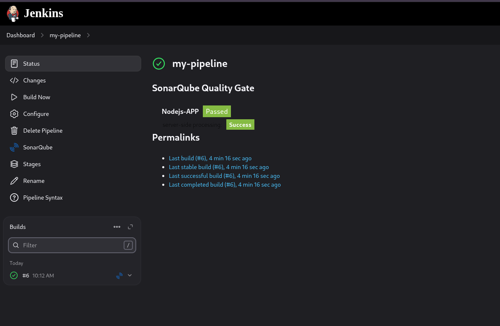
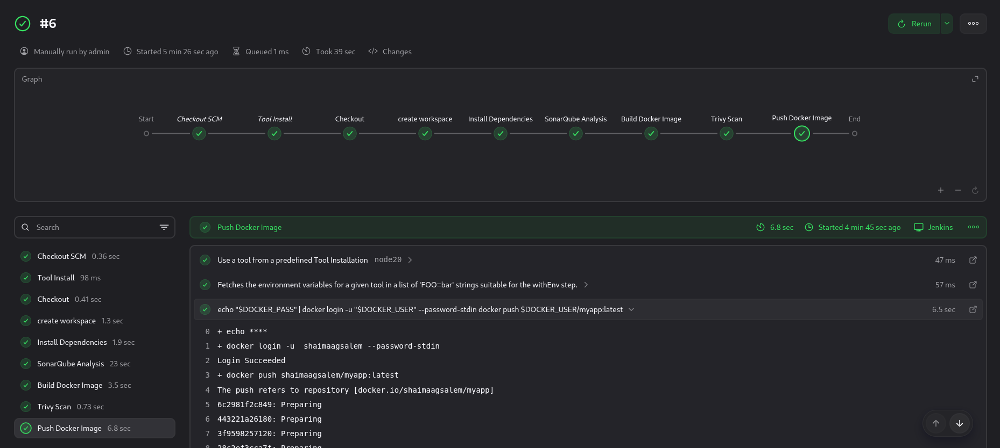

# 🛠️ CI/CD Pipeline Project on AWS with Terraform, Jenkins, and ArgoCD

## 🚀 Overview

This project demonstrates a complete CI/CD pipeline setup on AWS using **Terraform**, **Jenkins**, **SonarQube**, **Trivy**, **DockerHub**, **ArgoCD**, **ArgoCD image Updator**, **Prometheus**, and **Grafana**. . The infrastructure is provisioned using Infrastructure as Code (IaC) with **Terraform**, while continuous integration and deployment are handled by Jenkins and ArgoCD respectively. The pipeline includes static code analysis, container image scanning, Docker image creation, and deployment to an EKS cluster using GitOps, , with system and application monitoring powered by Prometheus and Grafana.

## 🧱 Architecture Diagram


### Amazon EKS Cluster Setup Guide

This guide walks you through configuring your environment to connect to an Amazon EKS cluster.

---

### Prerequisites

- AWS CLI installed and configured
- Install kubectl

### Connect kubectl to an EKS

Create or update a kubeconfig file for your cluster.

```bash
aws eks update-kubeconfig --region us-east-1 --name eks_my_cluster
```

Test your configuration

```bash
kubectl get svc
```

### Jenkins CI Pipeline:
- Pulls code from GitHub.
- Installs Node.js dependencies (npm install)
- Analyzes code quality with SonarQube.
- Builds a Docker image tagged with the Jenkins build number
- Scans the Docker image for vulnerabilities using Trivy
- Pushes the scanned, secure image to DockerHub 

### ArgoCD GitOps (CD) Pipeline:
- ArgoCD continuously syncs Kubernetes manifests from the GitHub repo
- Automatically deploys application updates to the cluster
- ArgoCD Image Updater monitors DockerHub for new image tags
- When a new image version is available, it updates the manifests and triggers ArgoCD to deploy the new version automatically

# 🚀 Steps I Followed 
# Continuous Integration (CI)  Setup

### 🔧 Jenkins Setup (on EC2 in Public Subnet)
The Jenkins master node is hosted on an Amazon EC2 instance within the public subnet. This instance is configured to serve as the core CI engine for the pipeline.
### ✅ Installed Jenkins Plugins
To enable CI features such as code analysis, Docker builds, and pipeline automation, the following Jenkins plugins were installed:

| Plugin Name                | Purpose                                                        |
|----------------------------|----------------------------------------------------------------|
| Eclipse Temurin Installer  | To install and manage JDK environments in Jenkins              |
| SonarQube Scanner          | For running static code analysis using SonarQube               |
| Sonar Quality Gates        | To enforce SonarQube quality gate thresholds                   |
| Quality Gates Plugin       | Additional integration with SonarQube quality gates            |
| Docker Plugin              | Adds Docker support to Jenkins nodes                           |
| Docker Commons Plugin      | Shared functionality for Docker-related plugins                |
| Docker Pipeline Plugin     | Enables Docker usage within declarative pipelines              |
| Docker API Plugin          | Communicates with Docker hosts                                 |
| Docker Build Step Plugin   | Adds Docker CLI commands to pipeline                     |
| NodeJS Plugin              | Allows Node.js tool installation and usage in pipelines        |


##### 🛠️ Global Tool Configuration (Jenkins → Manage Jenkins → Tools)
The following tools were configured under **Global Tool Configuration**:


| Tool Name           | Details                                                           |
|---------------------|-------------------------------------------------------------------|
| JDK                 | Installed via Eclipse Temurin Installer (Java 17 used)            |
| Node.js             | Added for projects that rely on Node.js (v20 configured)          |
| Docker              | Docker CLI configured to allow Jenkins to build images            |
| SonarQube Scanner   | Configured with the SonarQube server for code analysis            |

#### ⚠️ Important Notes

- **Node.js is already installed on the EC2 instance using an SonarQube Ansible playbook.**
- However, it's important to **verify that the installed Node.js version is 20 or higher**.
- If the version is **lower than 20**, follow the steps below to manually install **Node.js v20.9.2** on the EC2 instance.

#### ✅ Node.js Installation Steps (on EC2 Instance)

To install Node.js 20.9.2, execute the following commands:

```bash
sudo apt update && sudo apt upgrade -y
```
- (Optional) Install required dependencies — already installed via Ansible playbook
- You can skip this step unless you face issues
```bash
sudo apt install -y curl ca-certificates gnupg


# Add NodeSource repository for Node.js 20.x
curl -fsSL https://deb.nodesource.com/setup_20.x | sudo -E bash -

# Install Node.js
sudo apt install -y nodejs
```
### 📊 SonarQube Configuration in Jenkins

To integrate SonarQube Server with Jenkins for static code analysis, follow these steps:

1. **Navigate to Jenkins → Manage Jenkins → Configure System.**
2. Scroll down to the **SonarQube servers** section.
3. Click **Add SonarQube**.
4. Configure the following fields:
   - **Name**: A unique name for this server.
   > 🔐 **Note:**: The **name** you assign to the SonarQube server (e.g., `MySonarServer`) is the **identifier you'll use inside your Jenkins pipeline** when wrapping analysis steps with `withSonarQubeEnv('MySonarServer')`.

   - **Server URL**: `http://<Private-IP-of-SonarQube-EC2>:9000`  
     *(like `http://10.0.1.10:9000` This is the private IP address of the EC2 instance running SonarQube.)*

5. Add your [**SonarQube authentication token**](#how-to-generate-a-sonarqube-authentication-token)
 under credentials and link it here.

### 🔁 Example Snippet in Jenkinsfile

```groovy
withSonarQubeEnv('MySonarServer') {
    sh 'sonar-scanner'
}
```
####  🔧 Post-Installation Step for SonarQube on EC2

After running the SonarQube Ansible playbook to install SonarQube, you **must manually configure the virtual memory settings** on the EC2 instance to meet Elasticsearch requirements.

##### Why This Is Needed

SonarQube internally uses **Elasticsearch**, which requires a minimum virtual memory setting (`vm.max_map_count`) of **262144**. Without this setting, SonarQube may fail to start or encounter stability issues.

##### ✅ Run the Following Commands on EC2

```bash
# Set the required vm.max_map_count value
echo 'vm.max_map_count=262144' | sudo tee -a /etc/sysctl.conf

# Apply the changes immediately
sudo sysctl -p
```
### How to Generate a SonarQube Authentication Token
-  Log in to your SonarQube instance
Open your browser and navigate to:
http://<Public-IP-of-SonarQube-EC2>:9000
Example: http://172.31.22.150:9000
-  Navigate to your user profile
    1. Click on your username in the top-right corner.
    2. Select “My Account” from the dropdown.

-  Go to the “Security” tab
- Under “Generate Tokens”:
    1. Enter a recognizable name like: jenkins-token
    2. Click “Generate”

> 🔒 Important: You will only see the token once. Copy it immediately and save it securely.

-  Add the token to Jenkins credentials:
    1. Go to Jenkins Dashboard → Manage Jenkins → Credentials
    2. Select (or create) the appropriate domain (e.g., (global)).
    3. Click “Add Credentials”
        - Kind: Secret text
        - Secret: Paste the generated SonarQube token
        - ID: Give it a name (e.g., sonar-token)

### SonarQube Architecture Diagram
         +-------------------------+
         |      Developer          |
         |  (Code Commit & Push)   |
         +-----------+-------------+
                     |
                     v
         +-----------+-------------+
         |         Jenkins          |
         |  (CI/CD Pipeline Runner) |
         +-----------+-------------+
                     |
     +---------------+----------------+
     | SonarQube Scanner (plugin/tool)|
     +---------------+----------------+
                     |
         +-----------v-------------+
         |     SonarQube Server    |    <== Running on EC2
         |-------------------------|
         |  Web UI (port 9000)     |
         |  Compute Engine         |
         |  Elasticsearch Engine   |
         |  PostgreSQL DB          |
         +-----------+-------------+
                     |
        +------------v------------+
        |     PostgreSQL DB       |
        | Stores analysis results |
        | Store SonarQube tokens  |
        | Store Users or groups   |
        +-------------------------+


### 🔍 Setup for Trivy
To integrate **Trivy** into the pipeline, use the scripts under the [`scripts`](./scripts/) folder:
- All related installation and configuration scripts for Trivy are located under the `scripts folder`
- `install_trivy.sh` – Installs Trivy

#### Add Docker Hub Credentials in Jenkins
- Go to Jenkins → Manage Jenkins → Credentials
- Choose (global) scope or the relevant one
- Click Add Credentials
    - Kind: Username with password
    - Username: your Docker Hub username
    - Password:  Docker Hub access token
    - ID: e.g. docker-hub-creds

- Use this ID (docker-hub-creds) in the pipeline.


# 🚀 CI Pipeline Output
👉 Here’s a visual confirmation of a successful Jenkins pipeline execution and SonarQube quality gate pass:
- 🟢 SonarQube Quality Gate Passed



- 🛠️ Jenkins Pipeline Execution




## 🧩 Build Pipeline Issues & Solutions
### 💾 Disk Space Issue and Solution
During the CI process, Jenkins builds (especially Docker builds and scans) may consume significant disk space.

Initially, the EC2 instance (t2.large with 8GB root volume) ran out of space, causing the pipeline to fail with the following error:

> ❌ Error: No space left on device

### 🛠️ How I Resolved It
To overcome this, I increased the EBS volume attached to the EC2 instance from the AWS Console and extended the partition on the instance.

#### ✅ Steps to Increase EC2 Disk Space
- Increase EBS Volume Size:
    - Go to AWS Console → EC2 → Volumes.
    - Select your volume attached to the EC2 instance.
    - Click Actions → Modify Volume.
    - Increase the size (e.g., from 8 GB to 30 GB).
    - Resize the Volume on EC2 Instance:

- Run the following commands on your EC2 instance to resize the volume:

```bash
# Check existing partitions
lsblk

# Grow the partition to use the additional space
sudo growpart /dev/nvme0n1 1

# Resize the filesystem
sudo resize2fs /dev/nvme0n1p1
```


#### References
- [sonarqube-setup](https://maazmohd313.hashnode.dev/sonarqube-setup-for-attaining-the-code-quality-of-project-using-docker-compose)

- [Generating and using tokens for sonarQube](https://docs.sonarsource.com/sonarqube-server/8.9/user-guide/user-account/generating-and-using-tokens/)

- [Configuring project in sonar-project.properties file](https://docs.sonarsource.com/sonarqube-server/9.9/analyzing-source-code/scanners/sonarscanner/)
